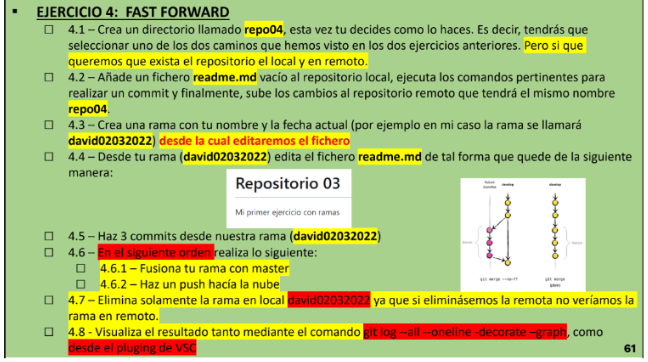
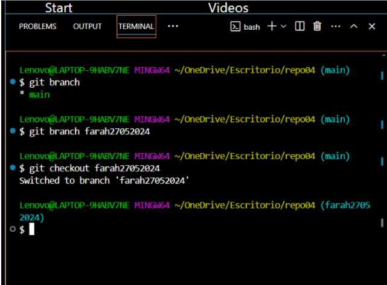
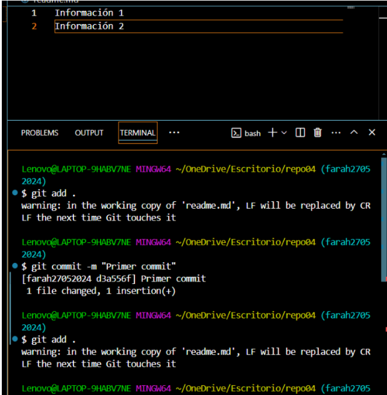

# Ejercicio 4

### Enunciado 

### 4.1

Creamos un repositorio remoto y lo clonamos con el siguiente comando `git clone [URL]`  

### 4.2

* Creamos el fichero
  * `touch readme.md`
* Lo añadimos al área de staging.
  * `git add .` o `git add readme.md`, el primero para añadir todo lo que tenemos en el repo en general y el segundo el archivo especificado
* Hacemos un commit
  * `git commit -m "txt"`
* Lo subimos al remoto 
  * `git push`
  
### 4.3

### 4.4

Modificamos el fichero readme para dejarlo como el enunciado.

### 4.5

Hacemos 3 commits desde la rama creada

- Vamos hacieno lo siguiente paso a paso:
  1.  Editamos el fichero manualmente desde VSC o con nano readme.md
  2.  Hacemos un `git add .`
  3.  Commit: `git commit -m "txt"`
  4.  Opcionalmente podemos ir subiéndolo al remoto con `git push`, también se puede hacer al final.
   

### 4.6 y 4.6

### 4.7

